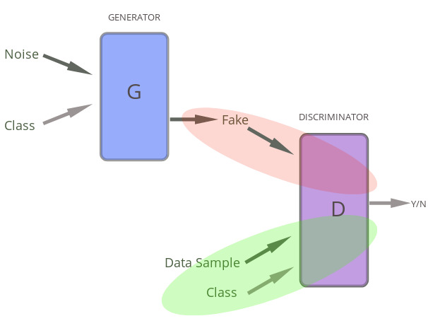
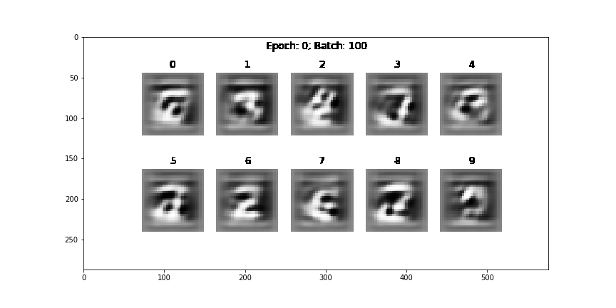

# Conditional_Deep_Conv_GAN
Implementation of **Conditional Deep Convolutional GAN** in low-level APIs using MXNet

***

## A Condtional GAN

***
## The Project:
1. Find the explanation in my [Medium article](https://medium.com/@suyashdamle/nuts-and-bolts-of-conditional-deep-convolutional-gans-58f6b9b8106a)

2. View the [kaggle kernel](https://www.kaggle.com/suyashdamle/conditional-gan-using-mxnet) to see the visualizations and experiment with the code
***
## Performance:

A sample of the generated image:

Improvement in generated images over iterations:

***
